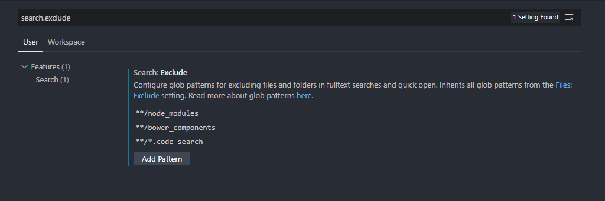
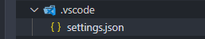

Especialmente útil en projectos usando `Django` para ignorar los archivos de la
carpeta `env` y las carpetas `__pycache__`.

### 1. Abrir el archivo de configuración

Para ignorarlos en todos tus proyecto ve a
`File > Preferences > Settings > User Settings.`

Alternativamente, con el atajo `cmd + ,` o `ctrl + ,`

### 2. Exlcuir archivos

Si se abre un archivo `settings.json`, entonces se agrega lo siguiente:

```json
// settings.json
"search.exclude": {
    "**/node_modules": true,
    "**/bower_components": true,
    "**/*.code-search": true,
    "**/env": true,
    "**/__pycache__": true
  }
```

En cambio, si se abre la versión UI, entonces se puede agregar dando _click_ al
botón `Add Pattern`



La sintáxis de esta propiedad es al misma de los patrones _glob._ Para saber más
acá está la
[documentación de VSCode](https://code.visualstudio.com/docs/editor/codebasics#_advanced-search-options).

### 3. Opcional: excluir localmente

Alternativamente, se puede hacer para un solo proyecto escribiendo
`Workspace Settings` en la Paleta de Comandos y se debería abrir un archivo
`settings.json` local, en el cual la configuración y sintáxis es la misma.


