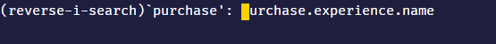
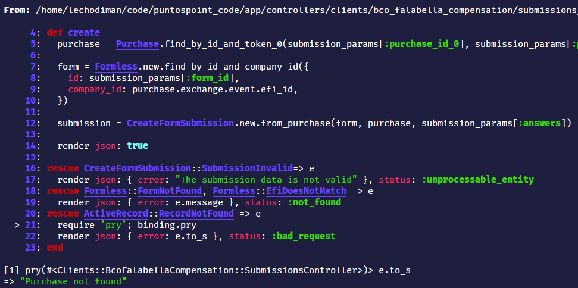
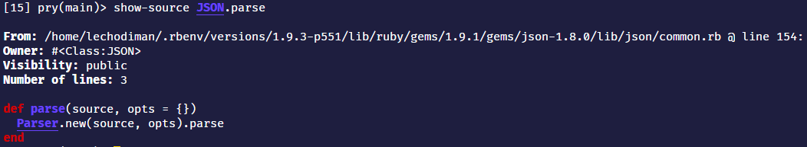

- [Rails console](#rails-console)
  - [Sandbox console](#sandbox-console)
  - [Búsqueda](#búsqueda)
  - [Reiniciar consola](#reiniciar-consola)
- [Usando Pry](#usando-pry)
  - [Instalación](#instalación)
  - [Como debugger](#como-debugger)
  - [Show-source](#show-source)
  - [Métodos especiales](#métodos-especiales)
- [Pry-rails](#pry-rails)
  - [Show-routes](#show-routes)
- [Pry-debug](#pry-debug)
- [VSCode Debugging](#vscode-debugging)

## Rails console

Para entrar a la consola, puedes entrar con `rails console` o con la abreviación
`rails c`.

> Pro tip: para salir de la consola de Rails, puedes presionar `ctrl+d` en vez
> de escribir `exit`

Para debuggear tests puede ser muy util examinar ese ambiente con
`rails console test`. Puede ser útil también cuando solo tienes gemas
disponibles en el ambiente de test.

### Sandbox console

Existe un modo de la consola de Rails que nos permite jugar con los datos y
modelos todo lo que queramos pero que al cerrar la sesión no se guarden los
datos. Esto puede ser súper útil si estás en modo adrenalina y quieres debugger
directo en producción. ⚰

```bash
rails c --sandbox
```

### Búsqueda

Si recuerdas que en algún momento hiciste una consulta dentro de la consola,
pero no puedes recordar bien, puedes usar _reverse search_ presionando `ctrl+r`



### Reiniciar consola

Si realizas cambios en el código, por ejemplo, en algun modelo y quieres probar
tus cambios, entonces debes ejecutar `reload!` en la consola para que tus
cambios tomen efecto.

Pero, cuidado! Si ya tienes variables asignadas en tu sesión activa de la
consola, entonces estas instancias no tendrán el código actualizado. Para
actualizarlas tendrás que reasignarlas.

## Usando Pry

[Pry](https://github.com/pry/pry) es una gema que nos permite tener acceso a una
consola interactiva con mejores funcionalidades que IRB.

### Instalación

```ruby
gem 'pry', '~> 0.13.1'
```

### Como debugger

En tu código `.rb` puedes agregar lo siguiente:

```ruby
require 'pry'; binding.pry
```

Esto detendrá la ejecución de un programa y te permitirá interactuar con las
variables del entorno.



En VSCode se puede agregar un _keyboard shortcut_ para agregar esta línea
rápidamente:

```json
{
  "Bind Pry": {
    "prefix": "pry",
    "body": ["require 'pry'; binding.pry"],
    "description": "Adds a pry binding for debugging"
  }
}
```

También puedes hacer esto mismo en las vistas e inspeccionar las variables de
ese _scope_ con:

```ruby
# some/view.html.erb
<%= binding.pry %>
```

### Show-source

Además, con el comando `show-source` se puede ver el código fuente de ciertas
clases, objecto, métodos, etc. Especialmente útil cuando estamos debuggeando que
no hemos escrito nosotros, como el de compañeros de trabajo o incluso el código
de librerías.



Si el método tiene una llamada a `super`, puedes ver la definición en la
superclase con`show-source pokemon.attack -s` agregando un `-s` por cada vez que
quieras ver la superclase (puedes ver la definición en la superclase de la
superclase con `show-source pokemon.attack -ss`)

### Métodos especiales

- `_` retorna la última expresión evaluada en la consola.
- `app` tiene una referencia a la aplicación Rails. Así puedes hacer cosas como
  `app.get(app.root_path))`
- `helper` provee acceso a los helpers de vistas.

## Pry-rails

Esta [gema](https://github.com/rweng/pry-rails) es la adaptación de pry para
tener aún más funcionalidades, pero esta vez específicas de Rails. Ten en cuenta
que al instalar esta gema, la consola interactiva que se ejecutaba con `rails c`
será reemplazada por una instancia de `pry`

```ruby
group :development, :test do
  gem "pry-rails"
end
```

Con esta gema, ahora podrás usar los comandos de `pry` como `show-source`dentro
de `rails c`

### Show-routes

Este comando nos listará todas las rutas disponibles en nuestra aplicación. Es
particularmente útil con la opción `--grep nombre-de-ruta-a-filtrar`

```bash
show-routes --grep pokemon
```

Esta ejecución nos retornaría todas las rutas que contengan el nombre `pokemon`
en su información (path, nombre, controlador, etc)

## Pry-debug

Si estás trabajando en un proyecto antiguo (Ruby < 2.0) entonces una buena
opción es [pry-debugger](https://github.com/nixme/pry-debugger). Si no, entonces
te recomiendo [pry-byebug](https://github.com/deivid-rodriguez/pry-byebug).
Estas gemas son bastante similares, pero la última tiene más y mejores
funcionalidades.

## VSCode Debugging

Esta es mi opción preferida, ya que puedo utilizar los mismos _shortcuts_ de
VSCode y ver la información de la misma manera que depuro en otros lenguajes y
frameworks.

Para ello, primero hay que instalar algunas gemas y configurar el archivo
`launch.json`

Lo mejor es seguir
[esta receta](https://github.com/microsoft/vscode-recipes/tree/master/debugging-Ruby-on-Rails),
ya que contiene los pasos súper bien explicados.
