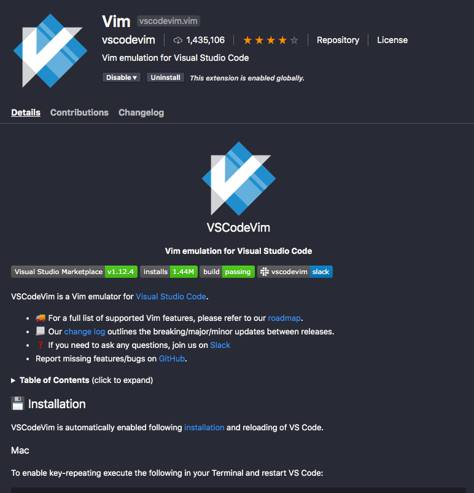
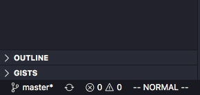

**Visual Studio Code** es mi editor de preferencia actualmente, y por varios
*motivos. El más importante es la capacidad de añadir funcionalidades con
*extensiones de una manera muy intuitiva.

**Vim** es fantástico. Es un editor de texto plano con cualidades de otro
*mundo. Permite ser configurado a gusto en muchos aspectos pero para mi gusto
*carece de _features_ importantes como un _debugger_.

La combinación de ambos es **absolutamente maravillosa**. Tenemos lo mejor de
los dos mundos: cualidades de IDE (debugger, terminal integrado) de VSCode y
combinaciones de _keystrokes_ eficientes de Vim.

A continuación te daré lo esencial para comenzar a explorar Vim en VSCode.

¿Qué cosas veremos en este artículo?

- [Vim](#vim)
- [Razón de usar Vim](#raz%c3%b3n-de-usar-vim)
- [Instalación en VSCode](#instalaci%c3%b3n-en-vscode)
- [Configuración inicial](#configuraci%c3%b3n-inicial)
- [Modos en Vim](#modos-en-vim)
- [Movimientos básicos](#movimientos-b%c3%a1sicos)
  - [Movimiento por caracter](#movimiento-por-caracter)
  - [Movimiento horizontal](#movimiento-horizontal)
  - [Movimiento vertical](#movimiento-vertical)
- [Conclusión](#conclusi%c3%b3n)
- [Recursos Adicionales](#recursos-adicionales)

En próximos artículos veremos características un poco más avanzadas pero que
marcan un antes y un después en la productividad al momento de desarrollar.

## Vim

Vim es un editor de texto plano que fue presentado inicialmente hace mucho
tiempo (según [wikipedia](https://es.wikipedia.org/wiki/Vim) en 1991). La
principal característica es que posee distintos modos para realizar
operaciones y además cuenta con un lenguaje para crear combinaciones de
_keystrokes_.

## Razón de usar Vim

Velocidad. La gran ventaja de Vim es que puedes editar y escribir código casi
tan rápido como lo piensas (ok, quizás es un poco exagerado, pero se entiende
el punto).

Personalmente, no me considero un usuario avanzado y aún sigo aprendiendo
cosas de Vim día a día, pero aún así he sentido los beneficios.

## Instalación en VSCode

- Ir a extensiones (`ctrl+shift+x` en windows y `cmd+shift+x` en mac)
- Buscar 'vim'
- Instalar la primera extension que aparece
- Voilá



Puede ser que después de instalar la extensión debas reiniciar el editor para
que esta tome efecto.

## Configuración inicial

Perfecto, ya tienes la extensión. Ahora, abre algún archivo en VSCode.

Inmediatamente vas a notar que no puedes escribir nada, lo que es perfectamente
normal, porque estás en **Normal Mode**.

Además, si intentas usar **keyboard shortcuts** de VSCode como `CTRL-C` o
`CTRL-V`, no se realizará la acción que deseas de copiar y pegar,
respectivamente.

Esto es porque en Vim hay varios **keystrokes** que están reservados. Por
ejemplo, `CTRL-F` es para hacer scroll hacia abajo media página.

Para mí esto fue sorpresivo porque implicaba borrar varios atajos que ya estaban
registrados en mi memoria muscular. Pero, todos estos cambios tienen una razón
de ser, y a fin de cuentas, los atajos nativos de Vim para copiar, pegar,
eliminar lineas, etc, son más eficientes que los que ya usaba.

Si quieres configurar qué combinaciones quieres mantener puedes modificar el
campo `"vim.handleKeys"` de tu `settings.json`. Para modificar este archivo,
puedes abrir la paleta de comandos con `CTRL-SHIFT-P` o `CMD-SHIFT-P` y escribir
'Open Settings (JSON)'.

Por ejemplo, yo aún mantengo `CTRL-F` para buscar:

```json
"vim.handleKeys": {
    "<C-f>": false,
  }
```

## Modos en Vim

Una vez que tengas la extensión configurada, hay que hablar de la principal
diferencia de Vim con los demás editores: los **modos**

Si abres un archivo y ves la barra inferior deberías ver algo como:



En la barra inferior (status bar) podrás ver `--NORMAL--`, lo que indica que
estás en Normal Mode.

Espera, ¿qué es eso de Normal Mode? Bueno, como te comentaba, Vim trabaja con
modos y dependiendo del modo en que estés, las teclas que presiones tendrán
distinto efecto. Los modos que usarás el 80% de tu tiempo son:

- **Normal Mode** se usa para moverse en el archivo y entre archivos. Como
  dice su nombre, es el modo 'normal' y es el modo en el que deberías pasar la
  mayor parte del tiempo. Para ir de cualquier otro modo a **normal mode,**
  presiona `<ESC>`

- **Insert Mode** es el modo para escribir texto. Podría decirse que este es
  el modo en el que está la mayoría de editores 'comúnes'. Para ir de **normal
  mode** a **insert mode**, presiona `i`

- **Visual Mode** es el modo para seleccionar texto. Es equivalente a lo que
  logras seleccionando texto con el _mouse_. Acá hay varios tipos de **visual
  modes** más que no detallaré en este artículo (pero son visual line mode,
  visual block mode, visual mode)

## Movimientos básicos

Para mover tu cursor con vim, se utilizan **motions**. Estas son teclas o
combinaciones de teclas específicas.

### Movimiento por caracter

Lo primero que todo el mundo aprende al iniciarse en Vim es a posicionar las
manos en el teclado.

Vim está optimizado para
[_touch typing_](https://en.wikipedia.org/wiki/Touch_typing), que básicamente,
es la forma **ergonómica y eficiente** de escribir. Para ello, lo primero es
posicionar los dedos de la mano izquierda en `asdf` y los de la mano derecha en
`jklñ` (si usas teclado latino americano) o `jkl;` (si usas teclado
estadounidense).

Para esto solo debes preocuparte que tus dedos indices estén sobre las teclas `f` y `j`, la cuales, convenientemente tienen una pequeña marca para poder sentir que tus dedos están en las teclas correctas.

Con esto las teclas más comunes estarán más cerca de nuestros dedos y las
menos usadas, estén más lejos.

Esta posición nos permitirá movernos con naturalidad usando:

- `h` Para ir un caracter hacia la izquierda
- `j` Para ir una línea hacia abajo
- `k` Para ir una línea hacia arriba
- `ñ` o `;` Para ir un caracter hacia la derecha

Este movimiento te puede parecer poco intuitivo, e incluso puede que tengas
dificultades recordando qué tecla sirve para moverse a la dirección que
deseas, o al menos, así fue en mi caso.

Para practicar el movimiento, te recomiendo darte una vuelta por el juego
[_Vim Adventures_](https://vim-adventures.com/), no toma más de 15 minutos en
completar la parte gratuita, que es más que suficiente para acostumbrarte al
movimiento.

### Movimiento horizontal

- Usa `w` para moverte al comienzo de la siguiente palabra ('w' de 'word').
- Usa `b` para moverte al final de la palabra anterior. ('b' de 'back')
- Usa `0` para moverte al inicio de la línea.
- Usa `$` para moverte al final de la línea. ('\$' como el delimitador del
  **final** de una
  [expresión regular](https://es.wikipedia.org/wiki/Expresi%C3%B3n_regular) )
- Una palabra (word) se delimita por espacios, puntos y letras. Pero, ¿por qué?
  Esto es porque Vim está diseñado para programar, y como es costumbre, en
  programación existen cosas como `console.log` y hay veces que solo nos
  queremos mover hasta el `.` y no hasta el comienzo de la siguiente palabra.
  Para delimitar únicamente por espacios, se usa el **motion** `W` y `B`

> Personalmente, creo que `$` y `0` están muy lejos de la posición natural de
> mis dedos, por que en su lugar uso `L` y `H`, respectivamente. Veremos
> _custom mappings_ en otro artículo.

### Movimiento vertical

Además de `j` y `k`, existen otros **motions** bastante útiles como:

- `{` Para moverte un **párrafo** arriba.
- `}` Similar pero para moverte un **párrafo** para abajo.
- `gg` Para ir al comienzo del documento
- `G` Para ir al final del documento

## Conclusión

Con esto sólo sabemos movernos en un archivo, si bien puede ser más rápido
que usar el mouse para posicionar el cursor, no es muy emocionante. El
verdadero poder de Vim se desata cuando usamos su lenguaje para hacer
modificaciones de forma intuitiva.

En próximos _posts_ de esta serie de Vim, vamos a aprender **motions**,
**operators**, **macros**, **plugins** y cómo usar las capacidades de VSCode
(como git, terminal integrado, etc) con **keystrokes** de Vim.

## Recursos Adicionales

- Si escribes en tu terminal `vimtutor`, podrás acceder a un tutorial bastante completo donde aprenderás lo básico e incluso un poco más.
- VSCode Vim [en github](https://github.com/VSCodeVim/Vim)
- [Vim Cheat Sheet](https://vim.rtorr.com/)
